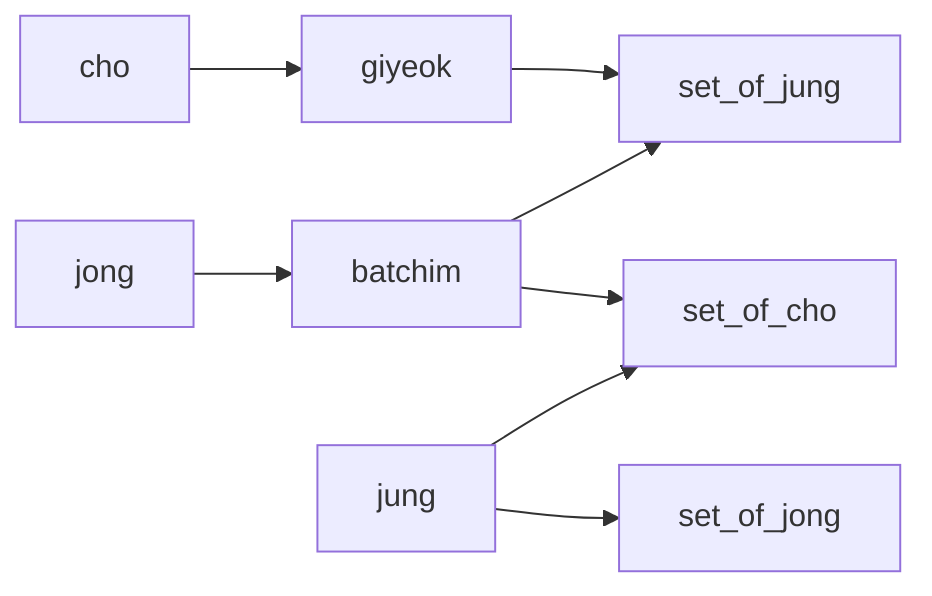

# How-Combinatorial-Hangul-Is-Constructed
How Combinatorial Hangul Is Constructed

## What is Hangul?
Hangul is Korean character.  

## What is Combinatorial Hangul?
Combining sub-glyphs to render Hangul looks better.
  
## Construction of Hangul  

Hangul has three components  

- cho ( choseong [cho-sung] ): Initial consonant.
- jung ( jungseong [joong-sung] ): Medial vowel.
- jong ( jongseong [jong-sung] ): Final consonant, optional.

These three components have designated positions.

\# : cho ( initial consonant )  
. : jung ( medial vowel )  
O : jong ( final consonant )  
| # | # | . |
| --- | --- | --- |
| . | . | . |
| O | O | O |


> Examples:  
> 가: ㄱ(cho) + ㅏ(jung) + No jong  
> 횃: ㅎ(cho) + ㅙ(jung) + ㅅ(jong)  
> 낼: ㄴ(cho) + ㅐ(jung) + ㄹ(jong)  
> 즈: ㅈ(cho) + ㅡ(jung) + No jong


## List of Components

- List of cho: ㄱㄲㄴㄷㄸㄻㅂㅃㅅㅆㅇㅈㅉㅊㅋㅌㅍㅎ  
- List of jung: ㅏㅐㅑㅒㅓㅔㅕㅖㅗㅘㅙㅚㅛㅜㅝㅞㅟㅠㅡㅢㅣ  
- List of jong: (none)ㄱㄲㄳㄴㄵㄶㄷㄹㄺㄻㄼㄽㄾㄿㅀㅁㅂㅄㅅㅆㅇㅈㅊㅋㅌㅍㅎ  
```
# How to get the order using python

# cho
for i in range(ord('가'),ord('힣'),ord('까')-ord('가')):
    print(chr(i))

# jung
for i in range(ord('가'),ord('까'),ord('개')-ord('가')):
    print(chr(i))

# jong
for i in range(ord('가'),ord('개'),ord('각')-ord('가')):
      print(chr(i))

# Note: 가 is the first character of Hangul unicode.
# Note: 힣 is the last character of Hangul unicode.
# Note: The offsets between the cho, jung, jong are identical.
```

## Flags used for rendering

- giyeok [ghi-yuck]: Is cho 'ㄱ' or 'ㄲ'.
- batchim [bhat-chim]: Has jong.

## Sets of components

- Commonly, cho has 8 sets of sub-glyphs.
- Commonly, jung has 4 sets of sub-glyphs.
- Commonly, jong has 4 sets of sub-glyphs.

## How to choose the set to render?


### Set of cho
- set 0: No batchim & jung ㅏㅐㅑㅒㅓㅔㅕㅖㅣ  
- set 1: No batchim & jung ㅗㅛㅡ  
- set 2: No batchim & jung ㅜㅠ  
- set 3: No batchim & jung ㅘㅙㅚㅢ  
- set 4: No batchim & jung ㅝㅞㅟ  
- set 5: batchim & jung ㅏㅐㅑㅒㅓㅔㅕㅖㅣ
- set 6: batchim & jung ㅗㅛㅡㅜㅠ
- set 7: batchim & jung ㅘㅙㅚㅢㅝㅞㅟ

### Set of jung
- set 0: giyeok & No batchim  
- set 1: No giyeok & No batchim  
- set 2: giyeok & batchim  
- set 3: No giyeok & batchim

### Set of jong
- set 0: jung ㅏㅑㅘ
- set 1: jung ㅓㅕㅚㅝㅟㅢㅣ
- set 2: jung ㅐㅒㅔㅖㅙㅞ
- set 3: jung ㅗㅛㅜㅠㅡ

